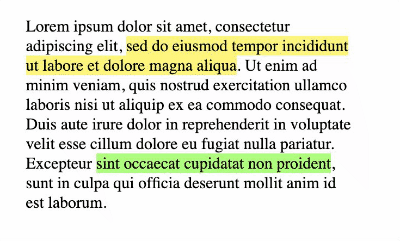

Use this library to create your own custom library or framework.

Example usage: https://jawadshuaib.github.io/custom-javascript-library/

Custom methods can be added to the prototype. Library invocation can also be easily customized.

To demonstrate, I created an example method using the library to create a rainbow highlighter. Method can be invoked using:

> c$ ('.content').rainbow();

Enjoy!
